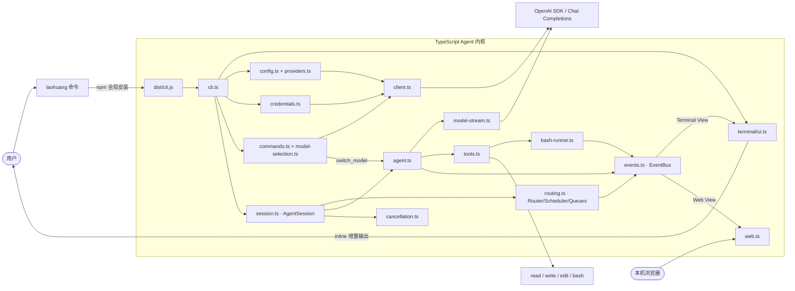
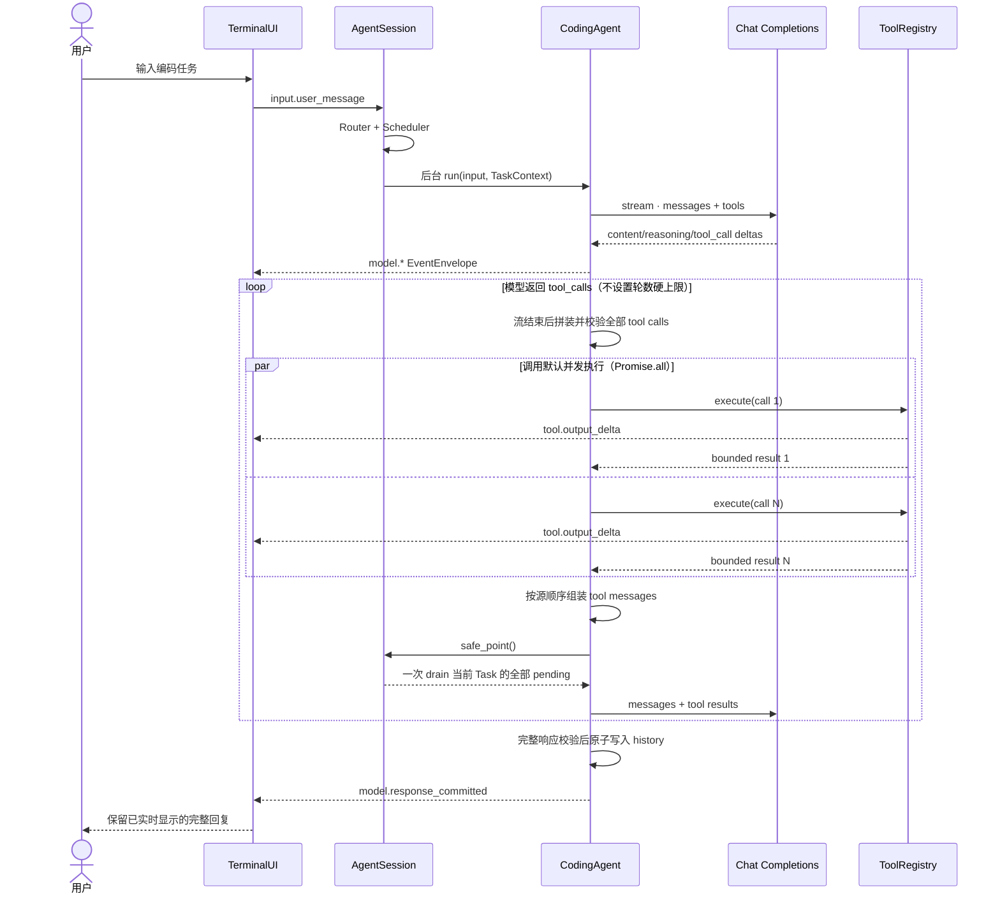

# 项目架构

`laoHuangCode` 是一个纯 TypeScript/Node.js 的 coding agent。npm 包 `laohuang`
是唯一制品：`tsc` 把 `src/` 编译到 `dist/`，`bin` 入口是 `dist/cli.js`，运行时
只依赖官方 `openai` npm SDK 和 Node.js 18+ 标准库，不需要 Python。

## 项目目录

```text
laoHuangCode/
├── .github/workflows/
│   ├── ci.yml                 # 持续集成
│   └── release.yml            # 发布 npm 制品
├── docs/
│   ├── architecture.md
│   ├── configuration.md
│   ├── npm-distribution.md
│   ├── publishing.md
│   ├── security.md
│   └── superpowers/           # 设计文档与历史记录
├── src/
│   ├── agent.ts               # 模型—工具循环与事件发布
│   ├── bash-runner.ts         # Bash 双流读取、限长结果与进程组取消
│   ├── cancellation.ts        # Task 级 CancelToken
│   ├── cli.ts                 # CLI 入口、config/doctor 子命令与交互 REPL
│   ├── client.ts              # OpenAI SDK 客户端工厂
│   ├── commands.ts            # Slash 命令与分层补全
│   ├── config.ts              # Profile 存储与解析
│   ├── credentials.ts         # 私有凭据文件
│   ├── events.ts              # EventEnvelope、EventBus 与投影脱敏
│   ├── model-stream.ts        # Chat Completions 流暂存、拼装与提交
│   ├── model-selection.ts     # 供应商与模型交互选择、首次启动凭据引导
│   ├── providers.ts           # DeepSeek/OpenAI 预设
│   ├── routing.ts             # 四层路由、Scheduler 与有界队列
│   ├── semantic-classifier.ts # 独立、无历史的小模型语义分类请求
│   ├── session.ts             # 后台任务、状态机、安全点与取消协调
│   ├── tools.ts               # read/write/edit/bash
│   ├── ui-state.ts            # UIState 与 UIEventReducer
│   ├── web.ts                 # 本地运行事件面板
│   └── terminal/
│       ├── ui.ts              # 唯一终端写入者与事件消费
│       ├── screen.ts          # 增量差分渲染器与可见宽度/wcwidth 工具
│       ├── editor.ts          # 原始输入解码、编辑器状态机与补全
│       ├── input.ts           # 首次启动设置问题的一次性 raw-mode 提示
│       ├── theme.ts           # 终端颜色 token 与 ANSI SGR 转换
│       └── markdown.ts        # Markdown 到带样式 ANSI 行的渲染
├── test/                      # node:test 离线测试套件
├── LICENSE
├── README.md
├── package.json
└── tsconfig.json
```

## 模块关系



## 并发模型：事件循环代替线程

整个运行时运行在单个 Node.js 事件循环上，没有工作线程：

- 所有异步边界都是 Promise：模型流、工具执行、队列 drain 和事件分发都通过
  `async`/`await` 串接，共享状态（history、队列、任务注册表）不需要锁。
- 同一批次的并发工具调用用 `Promise.all` 并行推进；实时事件仍按实际完成顺序
  发出，回传模型的 `tool` 消息保持原始调用顺序。
- 跨组件取消由 `cancellation.ts` 的共享 `CancelToken` 协调：模型 stream、尚未
  启动的工具和活动 Bash 进程组各自注册回调，取消是协作式的。
- `events.ts` 的 EventBus 为每个 Terminal/Web 订阅者维护一个独立的有界
  mailbox，由各自的 Promise 循环排空；慢消费者只在自己的 mailbox 上堆积，
  不会阻塞 Agent 或其他消费者。

唯一的“后台”执行体是 Bash 子进程：`bash-runner.ts` 用 `detached` 子进程建立
独立进程组，stdout/stderr 通过 Node stream 异步读取，事件循环始终保持响应。

## 一次请求的调用流程



Agent 会向模型追加每个调用对应的 `tool` 角色结果，保持每个 `tool_call_id` 都有
配对响应，再让模型解释结果或选择其他方案。

运行时不限制工具轮数或模型请求次数，只限制累计 Token 和单任务耗时。相同工具、参数与
稳定结果连续出现 3 次时会提前触发循环保护；`duration_ms` 等易变观测字段不参与结果
指纹。触发任一保护后不再执行工具，只允许额外一次 `tool_choice=none` 的模型请求根据
已有信息收尾。若供应商仍返回工具调用或收尾请求失败，错误会包含触发原因、工具轮数、
模型请求数、累计 Token 与耗时。`model.response_summary` 和 `agent.guard_*` 事件会把
每轮 usage 及保护决策同步到 Web 面板。

## 事件路由、队列与取消

所有用户输入先创建 `EventEnvelope`，再由四层 Router 依次执行：结构化元数据匹配、
确定性语义规则、独立无历史的小模型分类，以及确定性安全裁决。分类器复用当前
Provider/API key，只发送活动任务的最小元数据与本条新消息；3 秒超时、非法 JSON 或
低置信度都会回退为安全的 follow-up。接口保留独立 router model 的扩展点。内部模型
和工具回调同样先经过 Router，但通常在第一层即可短路，不会调用语义分类器。

同一 Session 只运行一个活动 Task。运行期间的普通输入进入有界 PendingQueue；
同一 Task 的全部 pending 消息在下一个模型/工具安全点通过原子快照一次 drain，不按
steer/follow-up 策略拆批，并携带原始 event ID 合并成一次模型输入。取消事件走立即
控制通道，pending 转入 HeldQueue，不会在任务停止后自动
执行；用户可通过 `/queue resume` 恢复。

PendingQueue/HeldQueue 同时限制消息条数与供应商无关的估算 token 数，避免少量超长
输入占满内存。容量拒绝和安全策略拒绝进入有界 DeadLetterQueue，`/queue` 可查看三类
队列与 token 估算；`/queue clear` 会一起清理。

Pending 批次采用 claim/ack 两阶段语义：写入临时 history 只表示已 claim，直到 SDK
真正创建下一次模型请求才 ack。若在两者之间取消，Session 会回滚尚未发送的 user
message，并把原始事件完整转入 HeldQueue，因此不会出现“history 有未回答消息但队列
已经丢失”的中间态。

Task 取消由共享 `CancelToken` 协调模型 stream、尚未启动的工具和活动 Bash 进程组。
已经提交的 assistant tool calls 始终补齐真实或 cancelled tool result；已完成的
write/edit/Bash 副作用不会自动回滚。

## 工具并发与顺序

Agent 默认采用批次语义：参数解析按模型给出的顺序完成，工具随后用 `Promise.all`
并发执行。`tool_result` 事件按实际完成顺序立即发出，
但加入会话历史并回传模型的 `tool` 消息始终保持原始 `tool_calls` 顺序，因此日志可
实时反映快慢，模型上下文仍然确定。

`CodingAgent({ toolExecution: "sequential" })` 可以把所有批次切换为串行。
`ToolRegistry` 支持按工具声明 `sequential` 执行模式；只要一个批次包含串行工具，
整个批次都会串行执行。

`write` 和 `edit` 使用解析后绝对路径作为修改锁的键。ToolRegistry 层允许不同文件
并发，但 CodingAgent 为保证一轮模型调用的确定性，只要批次包含 `write` 或 `edit`，
就保守地串行执行整个批次，避免 read/write 与多次修改之间的竞态。纯 read 批次和
多个 `bash` 仍可并发；`bash` 可能修改任意未知文件，因此多个 Bash 之间的副作用由
用户环境承担。

`bash` 使用独立进程组（`detached` 子进程），stdout/stderr 通过 Node stream
异步读取。输出经过 UTF-8 增量解码（`StringDecoder`）与终端
控制字符清理，达到 4KB 或约 40ms 时发布 `tool.output_delta`；交给模型的最终结果
每个 stream 最多保留配置上限，并采用前 40% + 后 60% 截断。取消时先向进程组发送
SIGTERM，2 秒后仍未退出再发送 SIGKILL。

## 终端渲染

`terminal/ui.ts` 是唯一终端写入者：一切可见内容都是 append-only 的块序列，可变块
inline 流式更新，轮次结束后冻结、绝不重写。`terminal/screen.ts` 是增量差分
渲染器，每帧只写一次同步输出，同时集中维护可见宽度、转义序列和 wcwidth 工具。
`terminal/editor.ts` 在字节层解码 stdin（bracketed paste、拆分转义序列、kitty
键盘协议），驱动文本/历史/补全状态机；`terminal/input.ts` 复用同一解码管线渲染
首次启动的设置问题。`terminal/theme.ts` 和 `terminal/markdown.ts` 手写了主题 token
到 SGR 的转换和一个小型 Markdown 渲染器，不依赖任何终端 UI 库。

## Web 可观测事件

启用 `--web` 后，Web 面板与 TerminalUI 订阅同一个 `EventBus`。模型、工具、路由、
队列和取消事件都使用不可变 `EventEnvelope`，包含 `event_id/session_id/task_id`、
`correlation_id` 和 Session 内严格递增的 `sequence`。每个消费者先经过
`EventProjector` 生成递归脱敏视图，API key、token、password 等字段不会进入面板；
DeepSeek 原始 reasoning delta 也不会进入 Terminal View。

事件规范会校验 source、必需 payload、字段类型、task/correlation 元数据与 payload
大小。模型文本同样按 4KB/约 40ms 合并后发布，避免把每个 SDK token 直接变成 UI
事件。EventBus 为每个 Terminal/Web 订阅者创建独立的有界 mailbox；慢消费者只对
自己的 mailbox 施加背压，高频相邻 delta 在接近容量时合并，并为控制/生命周期事件
保留容量。若一个投影连保留容量也完全耗尽，只丢弃该慢投影的后续视图，不能阻塞
Agent、取消或其他消费者；Canonical pull buffer 仍保留最近的有界事件用于诊断。

本地命令反馈同样发布为 `ui.message`，与模型和工具事件共用 Session sequence；这样
命令提示不会越过更早的模型分片。Session 正常关闭时会先排空事件，再关闭 EventBus
subscriber mailbox，避免嵌入式调用或重复测试留下悬挂的 Promise 循环。

浏览器每 500ms 从 `/api/events?after=<id>` 拉取增量事件。日志仅在内存中，CLI 退出
时 Web 服务一并停止。

> 当前没有工具确认或 Bash 沙箱。`bash` 拥有当前用户在操作系统中的权限。
