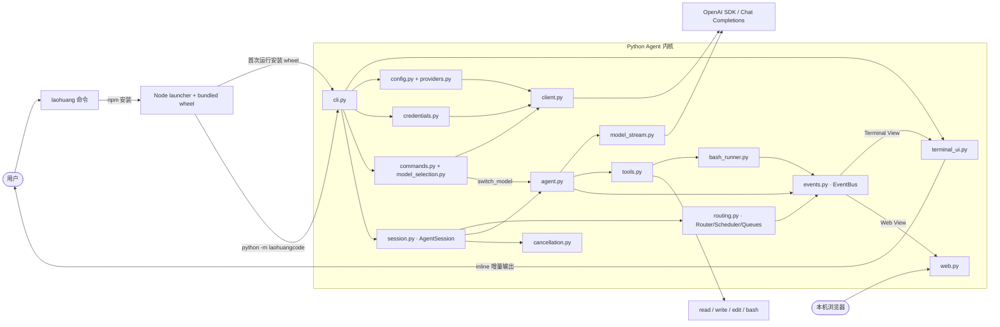
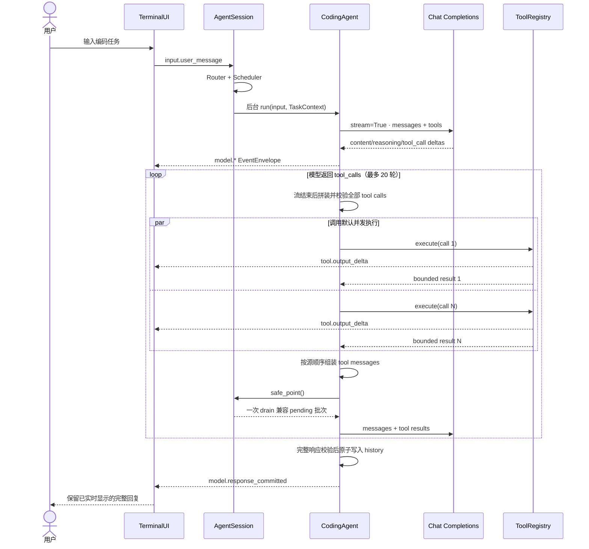

# 项目架构

`laoHuangCode` 刻意保持一个 Python Agent 内核。Python 包可直接提供 `laohuang`
命令；npm 包只解决全局安装与启动体验，不复制业务逻辑。

## 项目目录

```text
laoHuangCode/
├── .github/workflows/
│   ├── ci.yml                 # Python / Node 持续集成
│   └── release.yml            # 构建内置 wheel 并发布 npm
├── docs/
│   ├── architecture.md
│   ├── configuration.md
│   ├── npm-distribution.md
│   ├── publishing.md
│   └── security.md
├── npm/
│   ├── bin/laohuang.js        # 全局命令入口
│   ├── lib/launcher.js        # Python 探测、缓存 venv、参数转发
│   ├── vendor/                # 发布构建时写入 Python wheel
│   ├── test/launcher.test.js
│   └── package.json
├── scripts/
│   ├── build-python.sh
│   ├── check_versions.py
│   ├── release-check.sh
│   └── test-install.sh
├── src/laohuangcode/
│   ├── __main__.py            # python -m 入口
│   ├── agent.py               # 模型—工具循环与事件发布
│   ├── bash_runner.py         # Bash 双流读取、限长结果与进程组取消
│   ├── cancellation.py        # Task 级 CancelToken
│   ├── cli.py                 # CLI、同步兼容入口、异步 REPL
│   ├── client.py              # OpenAI SDK 客户端工厂
│   ├── commands.py            # CommandRegistry、Slash 命令与分层补全
│   ├── config.py              # Profile 存储与解析
│   ├── credentials.py         # 私有凭据文件
│   ├── events.py              # EventEnvelope、EventBus 与投影脱敏
│   ├── model_stream.py        # Chat Completions 流暂存、拼装与提交
│   ├── model_selection.py     # 供应商与模型交互选择、首次启动凭据引导
│   ├── providers.py           # DeepSeek/OpenAI 预设
│   ├── routing.py             # 四层路由、Scheduler 与有界队列
│   ├── semantic_classifier.py # 独立、无历史的小模型语义分类请求
│   ├── session.py             # 后台任务、状态机、安全点与取消协调
│   ├── terminal_ui.py         # 唯一终端写入者与事件消费
│   ├── tools.py               # read/write/edit/bash
│   ├── ui_state.py            # UIState 与 UIEventReducer
│   └── web.py                 # 本地运行事件面板
├── tests/                     # Python 离线测试
├── LICENSE
├── README.md
└── pyproject.toml
```

## 模块关系



## 一次请求的调用流程



Agent 会向模型追加每个调用对应的 `tool` 角色结果，保持每个 `tool_call_id` 都有
配对响应，再让模型解释结果或选择其他方案。

## 事件路由、队列与取消

所有用户输入先创建 `EventEnvelope`，再由四层 Router 依次执行：结构化元数据匹配、
确定性语义规则、独立无历史的小模型分类，以及确定性安全裁决。分类器复用当前
Provider/API key，只发送活动任务的最小元数据与本条新消息；3 秒超时、非法 JSON 或
低置信度都会回退为安全的 follow-up。接口保留独立 router model 的扩展点。内部模型
和工具回调同样先经过 Router，但通常在第一层即可短路，不会调用语义分类器。

同一 Session 第一版只运行一个活动 Task。运行期间的普通输入进入有界 PendingQueue；
兼容消息在模型/工具安全点通过原子快照一次 drain，并携带原始 event ID 合并成一次
模型输入。取消事件走立即控制通道，pending 转入 HeldQueue，不会在任务停止后自动
执行；用户可通过 `/queue resume` 恢复。

PendingQueue/HeldQueue 同时限制消息条数与供应商无关的估算 token 数，避免少量超长
输入占满内存。容量拒绝和安全策略拒绝进入有界 DeadLetterQueue，`/queue` 可查看三类
队列与 token 估算；`/queue clear` 会一起清理。

Pending 批次采用 claim/ack 两阶段语义：写入临时 history 只表示已 claim，直到 SDK
真正创建下一次模型请求才 ack。若在两者之间取消，Session 会回滚尚未发送的 user
message，并把原始事件完整转入 HeldQueue，因此不会出现“history 有未回答消息但队列
已经丢失”的中间态。

Task 取消由共享 `CancelToken` 协调模型 stream、尚未启动的工具和活动 Bash 进程组。
已经提交的 assistant tool calls 始终补齐真实或 cancelled tool result；已完成的
write/edit/Bash 副作用不会自动回滚。

## 工具并发与顺序

Agent 默认采用与 Pi 相同的批次语义：参数解析按模型给出的顺序完成，工具随后在
线程池中并发执行。`tool_result` 事件按实际完成顺序立即发出，
但加入会话历史并回传模型的 `tool` 消息始终保持原始 `tool_calls` 顺序，因此日志可
实时反映快慢，模型上下文仍然确定。

`CodingAgent(tool_execution="sequential")` 可以把所有批次切换为串行。
`ToolRegistry(execution_modes={"tool_name": "sequential"})` 可以声明单工具覆盖；
只要一个批次包含串行工具，整个批次都会串行执行。

`write` 和 `edit` 使用解析后绝对路径作为修改锁的键。ToolRegistry 层允许不同文件
并发，但 CodingAgent 为保证一轮模型调用的确定性，只要批次包含 `write` 或 `edit`，
就保守地串行执行整个批次，避免 read/write 与多次修改之间的竞态。纯 read 批次和
多个 `bash` 仍可并发；`bash` 可能修改任意未知文件，因此多个 Bash 之间的副作用由
用户环境承担。

`bash` 使用独立进程组和 stdout/stderr 双读取线程。输出经过 UTF-8 增量解码与终端
控制字符清理，达到 4KB 或约 40ms 时发布 `tool.output_delta`；交给模型的最终结果
每个 stream 最多保留配置上限，并采用前 40% + 后 60% 截断。取消时先向进程组发送
SIGTERM，2 秒后仍未退出再发送 SIGKILL。

## Web 可观测事件

启用 `--web` 后，Web 面板与 TerminalUI 订阅同一个 `EventBus`。模型、工具、路由、
队列和取消事件都使用不可变 `EventEnvelope`，包含 `event_id/session_id/task_id`、
`correlation_id` 和 Session 内严格递增的 `sequence`。每个消费者先经过
`EventProjector` 生成递归脱敏视图，API key、token、password 等字段不会进入面板；
DeepSeek 原始 reasoning delta 也不会进入 Terminal View。

事件规范会校验 source、必需 payload、字段类型、task/correlation 元数据与 payload
大小。模型文本同样按 4KB/约 40ms 合并后发布，避免把每个 SDK token 直接变成 UI
事件。EventBus 为每个 Terminal/Web 订阅者创建独立的有界 mailbox；慢消费者只对
自己的 mailbox 施加背压，高频相邻 delta 在接近容量时合并，并为控制/生命周期事件
保留容量。若一个投影连保留容量也完全耗尽，只丢弃该慢投影的后续视图，不能阻塞
Agent、取消或其他消费者；Canonical pull buffer 仍保留最近的有界事件用于诊断。

本地命令反馈同样发布为 `ui.message`，与模型和工具事件共用 Session sequence；这样
命令提示不会越过更早的模型分片。Session 正常关闭时会先排空事件，再关闭 EventBus
subscriber mailbox，避免嵌入式调用或重复测试累积后台线程。

浏览器每 500ms 从 `/api/events?after=<id>` 拉取增量事件。日志仅在内存中，CLI 退出
时 Web 服务一并停止。

> 当前没有工具确认或 Bash 沙箱。`bash` 拥有当前用户在操作系统中的权限。
