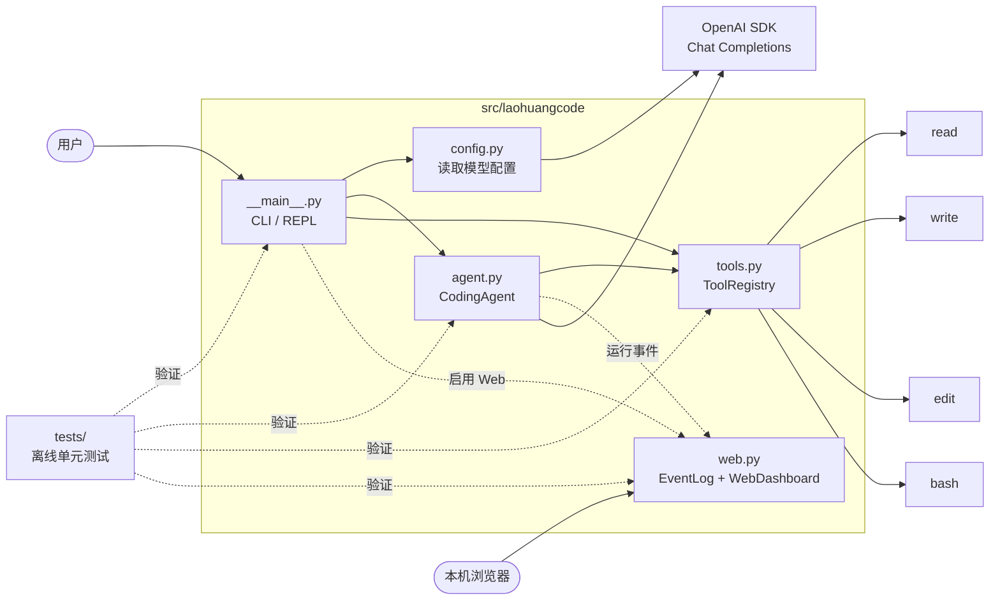
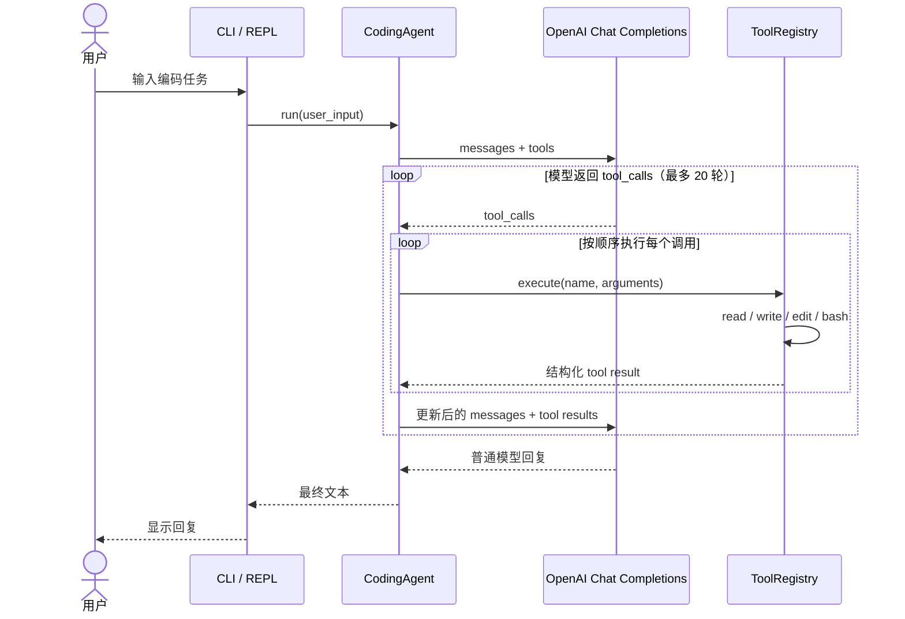

# 项目架构

`laoHuangCode` 是一个刻意保持简单的 coding agent：终端入口负责交互和组装依赖，`CodingAgent` 维护消息历史与模型调用循环，`ToolRegistry` 负责定义并执行本地工具，可选的本地 Web 面板负责展示运行事件。

## 模块关系

- `__main__.py` 启动 REPL、构造 OpenAI 客户端，并展示工具调用事件。
- `config.py` 从环境变量读取 API key、模型名和可选的兼容服务地址。
- `agent.py` 保存会话历史，并驱动“模型调用 → 工具执行 → 结果回传”的循环。
- `tools.py` 同时提供工具的 JSON Schema 与执行逻辑；`read`、`write`、`edit` 受项目根目录限制，`bash` 在项目根目录中运行。
- `web.py` 在线程安全的内存日志中保存运行事件，并通过只监听 `127.0.0.1` 的 HTTP 服务提供观察页面和 `/api/events`。

## 一次请求的调用流程

图中的 `tool result` 会作为 `tool` 角色消息追加到会话历史，然后再次发送给模型。模型不再请求工具、而是返回普通文本时，本轮任务结束，REPL 继续等待下一次用户输入。

## Web 可观测事件

启用 `--web` 后，`CodingAgent` 在不改变消息协议的前提下旁路发送以下事件：

- `user_message`：用户输入。
- `model_request`：模型请求轮次和当前消息数量。
- `model_response`：本轮返回的工具数量、名称及调用 ID。
- `tool_start`：工具所在模型轮次、批次大小及批次内序号。
- `tool_result`：工具结构化结果。
- `assistant_response`：最终文本。
- `model_error` / `agent_error`：请求或循环错误。

事件中的 `turn` 标识用户对话轮次，`round` 标识该用户轮次内的模型请求轮次，`batch_size` 和 `index` 标识同一次模型响应中的工具批次。例如，同一 `(turn, round)` 出现四个 `tool_start`，且其 `batch_size` 均为 `4`，说明模型一次返回了四个 `tool_calls`；如果工具分布在不同 `round`，则属于多轮 ReAct。

浏览器每 500ms 从 `/api/events?after=<id>` 拉取增量事件。日志仅保存在当前进程内；退出 CLI 时 Web 服务停止，日志随之清空。

> `bash` 会自动执行模型生成的命令，目前没有操作系统级沙箱；路径限制只适用于 `read`、`write` 和 `edit`。
