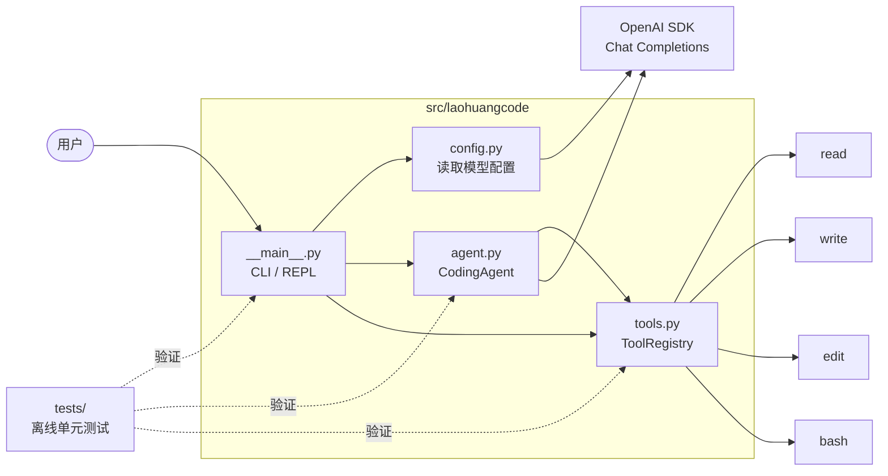
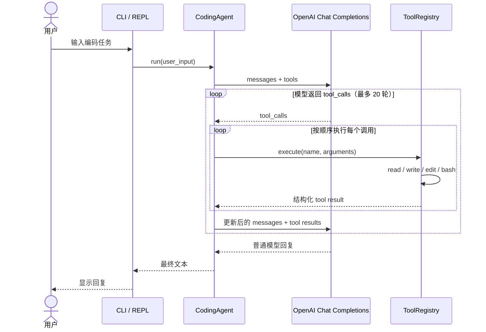

# 项目架构

`laoHuangCode` 是一个刻意保持简单的 coding agent：终端入口负责交互和组装依赖，`CodingAgent` 维护消息历史与模型调用循环，`ToolRegistry` 负责定义并执行本地工具。

## 模块关系

- `__main__.py` 启动 REPL、构造 OpenAI 客户端，并展示工具调用事件。
- `config.py` 从环境变量读取 API key、模型名和可选的兼容服务地址。
- `agent.py` 保存会话历史，并驱动“模型调用 → 工具执行 → 结果回传”的循环。
- `tools.py` 同时提供工具的 JSON Schema 与执行逻辑；`read`、`write`、`edit` 受项目根目录限制，`bash` 在项目根目录中运行。

## 一次请求的调用流程

图中的 `tool result` 会作为 `tool` 角色消息追加到会话历史，然后再次发送给模型。模型不再请求工具、而是返回普通文本时，本轮任务结束，REPL 继续等待下一次用户输入。

> `bash` 会自动执行模型生成的命令，目前没有操作系统级沙箱；路径限制只适用于 `read`、`write` 和 `edit`。
