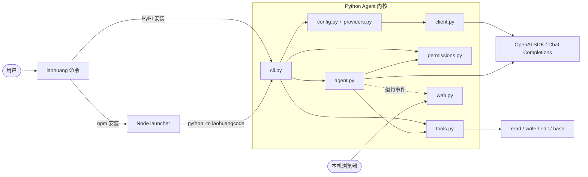
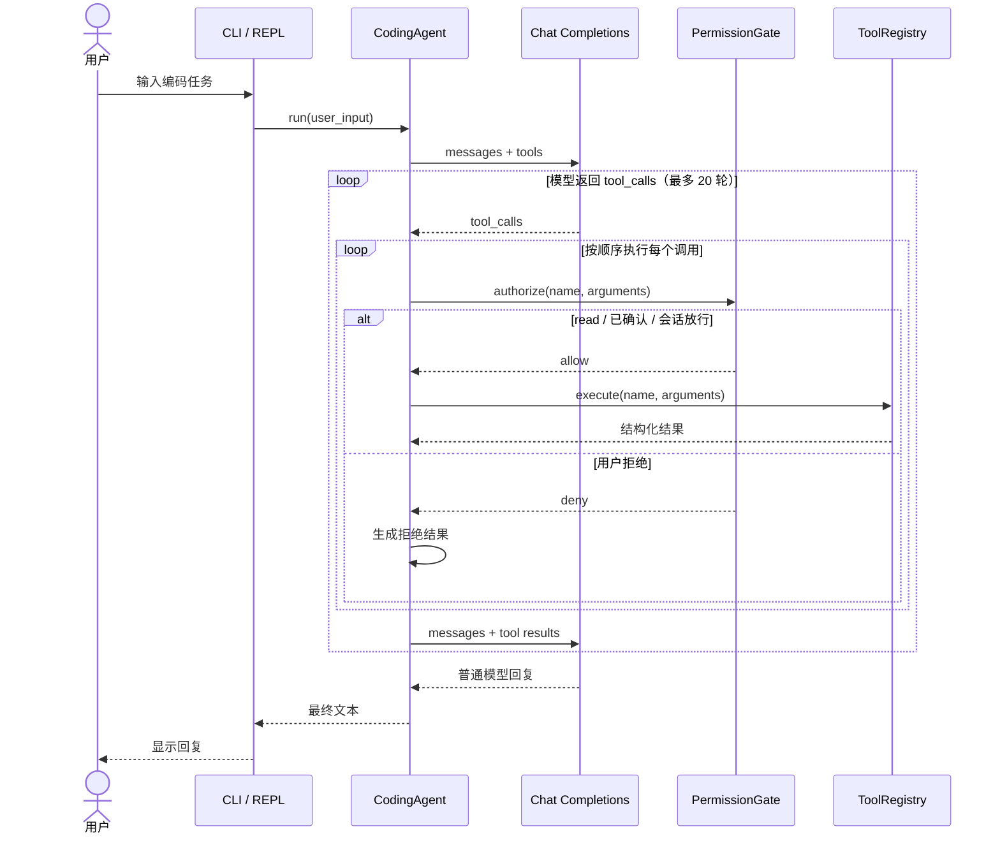

# 项目架构

`laoHuangCode` 刻意保持一个 Python Agent 内核。Python 包可直接提供 `laohuang`
命令；npm 包只解决全局安装与启动体验，不复制业务逻辑。

## 项目目录

```text
laoHuangCode/
├── .github/workflows/
│   ├── ci.yml                 # Python / Node 持续集成
│   └── release.yml            # PyPI -> npm 顺序发布
├── docs/
│   ├── architecture.md
│   ├── configuration.md
│   ├── npm-distribution.md
│   ├── publishing.md
│   └── security.md
├── npm/
│   ├── bin/laohuang.js        # 全局命令入口
│   ├── lib/launcher.js        # Python 探测、缓存 venv、参数转发
│   ├── test/launcher.test.js
│   └── package.json
├── scripts/
│   ├── build-python.sh
│   ├── check_versions.py
│   ├── release-check.sh
│   └── test-install.sh
├── src/laohuangcode/
│   ├── __main__.py            # python -m 入口
│   ├── agent.py               # Agent loop
│   ├── cli.py                 # CLI、子命令、REPL
│   ├── client.py              # OpenAI SDK 客户端工厂
│   ├── config.py              # Profile 存储与解析
│   ├── credentials.py         # Provider 凭据解析
│   ├── permissions.py         # 工具权限闸门
│   ├── providers.py           # DeepSeek/OpenAI/custom 预设
│   ├── tools.py               # read/write/edit/bash
│   └── web.py                 # 本地运行事件面板
├── tests/                     # Python 离线测试
├── LICENSE
├── README.md
└── pyproject.toml
```

## 模块关系



## 一次请求的调用流程



即使用户拒绝工具，Agent 也会向模型追加对应的 `tool` 角色结果，保持每个
`tool_call_id` 都有配对响应，再让模型解释或选择其他方案。

## Web 可观测事件

启用 `--web` 后，`CodingAgent` 旁路发送：

- `user_message`、`model_request`、`model_response`。
- `tool_start`、`tool_approved`、`tool_denied`、`tool_result`。
- `assistant_response`、`model_error`、`agent_error`。

事件中的 `turn` 标识用户轮次，`round` 标识一次用户轮次内的模型请求轮次，
`batch_size` 和 `index` 标识同一次响应里的工具批次。浏览器每 500ms 从
`/api/events?after=<id>` 拉取增量事件。日志仅在内存中，CLI 退出时 Web 服务一并
停止。

> 权限确认不是沙箱。尤其是 `bash`，获准后仍拥有当前用户在操作系统中的权限。
