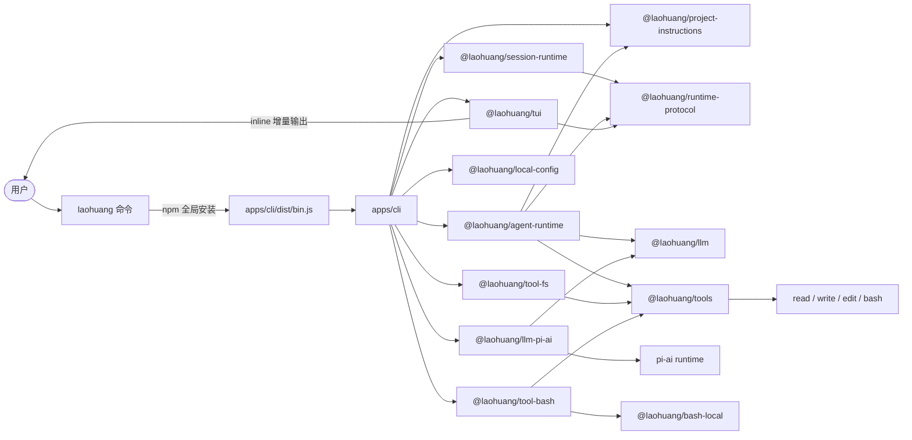
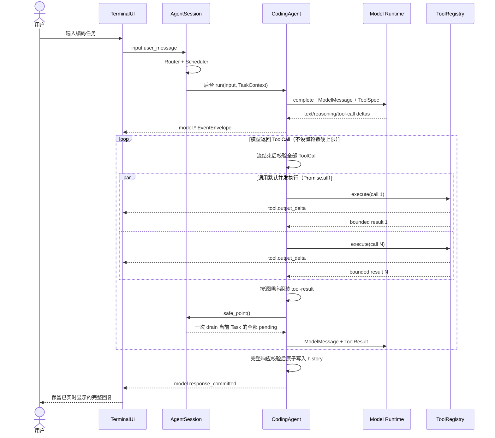

# 项目架构

`laoHuangCode` 是一个纯 TypeScript/Node.js 的 coding agent。npm 包 `laohuang`
是唯一发布制品：私有根 workspace 负责编排 TypeScript project references，
`apps/cli` 把 CLI bundle 写入 `apps/cli/dist/bin.js`，运行时只依赖
`@earendil-works/pi-ai@^0.83.0`、Windows 终端原生适配依赖 `koffi@3.2.1`
和 Node.js >=22.19.0 标准库，不需要 Python。

## 项目目录

```text
laoHuangCode/
├── .github/workflows/
│   ├── ci.yml                 # 持续集成
│   └── release.yml            # 发布 npm 制品
├── docs/
│   ├── architecture.md
│   ├── configuration.md
│   ├── npm-distribution.md
│   ├── publishing.md
│   ├── security.md
│   └── superpowers/           # 设计文档与历史记录
├── apps/
│   └── cli/
│       ├── src/               # CLI composition root、commands、REPL、model selection
│       ├── dist/bin.js        # 发布包 bin 入口，构建产物
│       ├── package.json       # npm 包 `laohuang` 的版本、bin、files 与 pi-ai 依赖
│       ├── README.md          # 随包发布的 README
│       └── LICENSE            # 随包发布的 license
├── packages/
│   ├── context/project-instructions/     # AGENTS/CODEX/project instruction 读取
│   ├── core/agent-runtime/               # 模型—工具循环与事件发布
│   ├── core/runtime-protocol/            # 事件、取消、队列、AgentRunner 等公共协议
│   ├── core/session-runtime/             # 后台任务、路由、队列、安全点与取消协调
│   ├── core/tools/                       # ToolRegistry 与工具协议
│   ├── fs/local-paths/                   # 本地路径、主目录与 Git Bash 路径转换
│   ├── fs/tool-fs/                       # read/write/edit 工具适配器
│   ├── llm/llm/                          # provider-neutral 模型领域合同
│   ├── llm/llm-pi-ai/                    # pi-ai 转换、stream、replay 与错误归一化
│   ├── shell/bash-local/                 # Bash 双流读取、限长结果与进程组取消
│   ├── shell/tool-bash/                  # Bash tool adapter
│   ├── storage/local-config/             # Profile 与凭据文件
│   └── terminal/tui/                     # 终端渲染、输入、补全和展示状态
├── scripts/                   # 测试与构建、检查、发布等工程脚本
│   ├── *.test.ts              # Node test 离线测试
│   ├── workspace-architecture.test.ts
│   ├── check-package-version.mjs
│   ├── package-smoke.mjs
│   ├── tui-smoke.sh
│   ├── verify-published-version.mjs
│   ├── test-stats.mjs
│   └── profile-cli.mjs
├── LICENSE
├── README.md
├── package.json               # 私有 workspace 根，仅编排 build/test/release checks
├── tsconfig.base.json
└── tsconfig.json              # project references
```

## 模块关系



根 `package.json` 是 private，只声明 `apps/*` 和 `packages/*/*`。每个内部 package
也是 private、版本固定为 `0.0.0`，只通过 `@laohuang/*` 包名公开根出口；生产代码不
跨 package root 使用相对导入，也不 deep-import 其他 workspace 的 `src/` 或 `dist/`。
`scripts/workspace-architecture.test.ts` 会持续检查这些约束和 workspace 依赖环。

`@laohuang/llm` 拥有 provider-neutral 模型消息、Catalog、API-key Auth、Platform、
事件、工具调用、工具结果、usage 和错误分类合同；只有 `@laohuang/llm-pi-ai` 允许导入
pi-ai，并把同一个 pi-ai `Models` 实例暴露为 Adapter、Catalog 和 Auth 三个视图。
Agent Runtime 拥有模型—工具循环和 history 提交，Tool Runtime 拥有工具执行。

Provider Platform 的产品合同把状态拆开：

- `available`: pi-ai catalog 中存在 API-key login，且没有被产品 policy 排除。
- `configured`: 本地 credential store 或 provider documented environment variables 可解析。
- `verified`: 有显式授权的真实 native tool-call/tool-result E2E 证据。

pi-ai 0.83.0 的 eligible-provider 快照为 35 个 provider IDs；`amazon-bedrock`、
`google-vertex` 被 policy 排除，OAuth-only providers 自动排除，`openai-codex` 不作为
API-key provider 暴露。`PROVIDER_VERIFICATIONS` 当前为空，因此 checked-in provider
不会被标为 verified。动态 provider 的 model catalog 由 `@laohuang/local-config`
持久化在 `models.json`，refresh 失败不会删除已有缓存。

## 并发模型：事件循环代替线程

整个运行时运行在单个 Node.js 事件循环上，没有工作线程：

- 所有异步边界都是 Promise：模型流、工具执行、队列 drain 和事件分发都通过
  `async`/`await` 串接，共享状态（history、队列、任务注册表）不需要锁。
- 同一批次的并发工具调用用 `Promise.all` 并行推进；实时事件仍按实际完成顺序
  发出，回传模型的 `tool` 消息保持原始调用顺序。
- 跨组件取消由 `cancellation.ts` 的共享 `CancelToken` 协调：模型 stream、尚未
  启动的工具和活动 Bash 进程组各自注册回调，取消是协作式的。
- `events.ts` 的 EventBus 为每个订阅者维护一个独立的有界
  mailbox，由各自的 Promise 循环排空；慢消费者只在自己的 mailbox 上堆积，
  不会阻塞 Agent 或其他消费者。

唯一的“后台”执行体是 Bash 子进程：`bash-runner.ts` 在 Unix 用 `detached` 建立
独立进程组，Windows 使用非 detached、隐藏控制台的子进程。stdout/stderr 通过 Node
stream 异步读取，事件循环始终保持响应。

## 一次请求的调用流程



Agent 会向模型追加每个调用对应的 provider-neutral tool-result，保持每个 ToolCall
都有配对响应，再让模型解释结果或选择其他方案。

运行时不限制工具轮数或模型请求次数，只限制累计 Token 和单任务耗时。相同工具、参数与
稳定结果连续出现 3 次时会提前触发循环保护；`duration_ms` 等易变观测字段不参与结果
指纹。触发任一保护后不再执行工具，只允许额外一次禁用工具的模型请求根据
已有信息收尾。若供应商仍返回工具调用或收尾请求失败，错误会包含触发原因、工具轮数、
模型请求数、累计 Token 与耗时。`model.response_summary` 和 `agent.guard_*` 事件会把
每轮 usage 及保护决策同步到事件总线。

## 事件路由、队列与取消

所有用户输入先创建 `EventEnvelope`，再由四层 Router 依次执行：结构化元数据匹配、
确定性语义规则、独立无历史的小模型分类，以及确定性安全裁决。分类器复用当前
当前 provider route，只发送活动任务的最小元数据与本条新消息；3 秒超时、非法 JSON 或
低置信度都会回退为安全的 follow-up。接口保留独立 router model 的扩展点。内部模型
和工具回调同样先经过 Router，但通常在第一层即可短路，不会调用语义分类器。

同一 Session 只运行一个活动 Task。运行期间的普通输入进入有界 PendingQueue；
`Ctrl+S` 提交的 steer 输入会在下一个模型/工具安全点优先 drain；输入为空时，
最早的 compatible pending 消息会被提升为 steer。没有 steer 时，同一 Task 的全部
pending 消息通过原子快照一次 drain，并携带原始 event ID 合并成一次模型输入。取消事件走立即
控制通道，pending 转入 HeldQueue，不会在任务停止后自动
执行；用户可通过 `/queue resume` 恢复。

PendingQueue/HeldQueue 同时限制消息条数与供应商无关的估算 token 数，避免少量超长
输入占满内存。容量拒绝和安全策略拒绝进入有界 DeadLetterQueue，`/queue` 可查看三类
队列与 token 估算；`/queue clear` 会一起清理。

Pending 批次采用 claim/ack 两阶段语义：写入临时 history 只表示已 claim，直到共享
Adapter 真正创建下一次模型请求才 ack。若在两者之间取消，Session 会回滚尚未发送的 user
message，并把原始事件完整转入 HeldQueue，因此不会出现“history 有未回答消息但队列
已经丢失”的中间态。

Task 取消由共享 `CancelToken` 协调模型 stream、尚未启动的工具和活动 Bash 进程组。
已经提交的 assistant ToolCall 始终补齐真实或 cancelled tool-result；已完成的
write/edit/Bash 副作用不会自动回滚。

## 工具并发与顺序

Agent 默认采用批次语义：参数解析按模型给出的顺序完成，工具随后用 `Promise.all`
并发执行。`tool_result` 事件按实际完成顺序立即发出，
但加入会话历史并回传模型的 tool-result 始终保持原始 ToolCall 顺序，因此日志可
实时反映快慢，模型上下文仍然确定。

`CodingAgent({ toolExecution: "sequential" })` 可以把所有批次切换为串行。
`ToolRegistry` 支持按工具声明 `sequential` 执行模式；只要一个批次包含串行工具，
整个批次都会串行执行。

`write` 和 `edit` 使用解析后绝对路径作为修改锁的键。ToolRegistry 层允许不同文件
并发，但 CodingAgent 为保证一轮模型调用的确定性，只要批次包含 `write` 或 `edit`，
就保守地串行执行整个批次，避免 read/write 与多次修改之间的竞态。纯 read 批次和
多个 `bash` 仍可并发；`bash` 可能修改任意未知文件，因此多个 Bash 之间的副作用由
用户环境承担。

`bash` 在 Unix 使用独立进程组（`detached` 子进程），stdout/stderr 通过 Node stream
异步读取。输出经过 UTF-8 增量解码（`StringDecoder`）与终端
控制字符清理，达到 4KB 或约 40ms 时发布 `tool.output_delta`；交给模型的最终结果
每个 stream 最多保留配置上限，并采用前 40% + 后 60% 截断。取消时先向进程组发送
SIGTERM，2 秒后仍未退出再发送 SIGKILL。Windows 使用 `detached: false` 和
`windowsHide: true`，取消或超时时调用系统目录下的 `taskkill.exe /F /T /PID`，
并等待其结果；taskkill 设置 5 秒超时。清理失败时尝试终止直接子进程，同时在结果的
`error` 中报告 `Process cleanup failed`，不把直接子进程退出当作整棵树清理成功。

Bash 退出后继续读取输出，每次收到数据都会重置计时；连续 100ms 没有输出时关闭仍
未结束的管道，并设置 `truncated: true`，表示可能遗漏后代进程的后续输出。Bash 尚未
退出时不使用这个空闲收尾规则。终止操作完成后最多再等待 1 秒退出与排空管道；若
Bash 仍未退出，报告清理失败并解除其对 Node 退出的阻塞。正常结束或取消结果只发布一次。

## 终端渲染

`tui/native-console.ts` 保存并恢复 raw/Win32 console mode，在 raw mode 之后启用
VT 输入，提供本地 Shift 状态回退。Koffi 仅在 Windows 原生终端入口按需加载，作为
外部运行时依赖随 npm 安装；非 Windows 平台不加载原生模块。主终端、独立设置提示和
隐藏输入共用模式生命周期；管道/SSH 输入不使用本机修饰键状态。

`tui/ui.ts` 是唯一终端写入者：一切可见内容都是 append-only 的块序列，可变块
inline 流式更新，轮次结束后冻结、绝不重写。`tui/screen.ts` 是增量差分
渲染器，每帧只写一次同步输出，同时集中维护可见宽度、转义序列和 wcwidth 工具。
`tui/editor.ts` 在字节层解码 stdin（bracketed paste、拆分转义序列、kitty
键盘协议），驱动文本/历史/补全状态机；`tui/input.ts` 复用同一解码管线渲染
首次启动的设置问题。`tui/theme.ts` 和 `tui/markdown.ts` 手写了主题 token
到 SGR 的转换和一个小型 Markdown 渲染器，不依赖任何终端 UI 库。

## 可观测事件

TerminalUI 订阅 runtime event stream。模型、工具、路由、队列和取消事件都使用不可变
`EventEnvelope`，包含 `event_id/session_id/task_id`、`correlation_id` 和 Session
内严格递增的 `sequence`。消费者先经过 `EventProjector` 生成递归脱敏视图，API key、
token、password 等字段不会进入展示面；供应商私有 replay 状态和原始 provider payload 也不会进入
Terminal View。

事件规范会校验 source、必需 payload、字段类型、task/correlation 元数据与 payload
大小。模型文本同样按 4KB/约 40ms 合并后发布，避免把每个 provider token 直接变成 UI
事件。EventBus 为每个订阅者创建独立的有界 mailbox；慢消费者只对自己的 mailbox
施加背压，高频相邻 delta 在接近容量时合并，并为控制/生命周期事件保留容量。若一个
投影连保留容量也完全耗尽，只丢弃该慢投影的后续视图，不能阻塞 Agent、取消或其他
消费者。

本地命令反馈同样发布为 `ui.message`，与模型和工具事件共用 Session sequence；这样
命令提示不会越过更早的模型分片。Session 正常关闭时会先排空事件，再关闭 EventBus
subscriber mailbox，避免嵌入式调用或重复测试留下悬挂的 Promise 循环。

> 当前没有工具确认或 Bash 沙箱。`bash` 拥有当前用户在操作系统中的权限。
