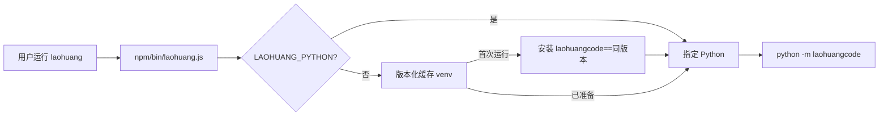

# npm 分发设计

## 为什么保留 Python 内核

`npm install -g laohuang` 的目标是提供类似 `claude` 的全局命令体验，而不是维护
Python 与 TypeScript 两套 Agent。npm 包只做三件事：

1. 找到 Python 3.11+。
2. 在用户缓存中创建与 npm 包版本绑定的虚拟环境。
3. 安装同版本 `laohuangcode` 并把全部参数转发给 `python -m laohuangcode`。

## 缓存与覆盖

- macOS：`~/Library/Caches/laohuang/python-<version>`。
- Linux：`${XDG_CACHE_HOME:-~/.cache}/laohuang/python-<version>`。
- `LAOHUANG_CACHE_HOME`：覆盖缓存根目录。
- `LAOHUANG_PYTHON`：跳过引导，直接使用指定 Python。
- `LAOHUANG_BOOTSTRAP_PYTHON`：指定用于创建 venv 的 Python。

开发和离线测试可设置 `LAOHUANG_PYTHON_PACKAGE`，让引导器从本地路径或私有索引
安装 Python 包；它不是普通用户配置项。

## 发布顺序

同一个版本必须先发布 Python 包，再发布 npm 包。否则新 npm 版本第一次运行时找不到
对应的 Python 内核。`scripts/check_versions.py` 会比较 `pyproject.toml`、Python
`__version__` 与 `npm/package.json`。
