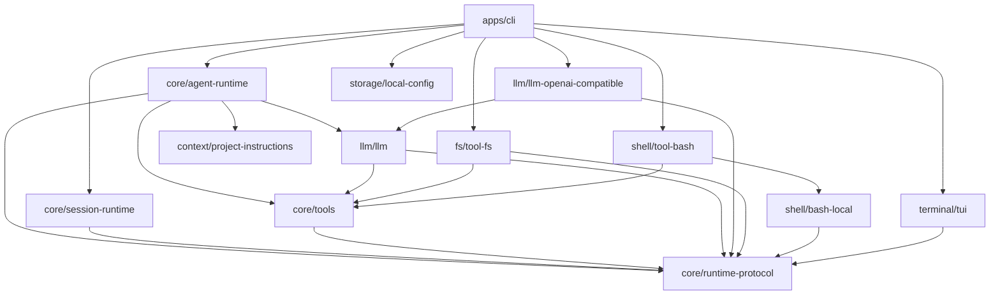

# Workspace Package Architecture Design

## Status

Approved architecture direction for converting laoHuangCode from one `src/`
tree into a DSH-style two-level npm workspace. This document defines the
complete repository shape, package ownership, dependency rules, build and
publishing contract, migration invariants, and acceptance criteria. It does
not implement the migration.

## Product contract

The repository remains one installable product: the `laohuang` coding-agent
CLI. Internally, every production TypeScript file belongs either to the CLI
application workspace or to an independently buildable private package. The
root contains no production `src/` directory after migration.

The package architecture must support adding a model Adapter, tool Adapter,
storage implementation, terminal host, SDK surface, or executable app by
adding a sibling package and changing application composition. Adding one of
those capabilities must not require moving the existing Agent loop, Session
runtime, TUI, or current Adapters.

Only `apps/cli` is published. Internal packages are private workspace
packages and are bundled into the CLI artifact. Installing
`npm install -g laohuang` must not attempt to download any private
`@laohuang/*` package.

## Goals

1. Adopt the structural rule `apps/*` plus `packages/<domain>/<package>`.
2. Make every leaf under `packages/` a real npm workspace package.
3. Give every production source file one package owner.
4. Keep package dependencies acyclic and directed toward stable protocols.
5. Preserve existing CLI, Agent, Session, tool, configuration, and TUI
   behavior.
6. Preserve one public npm artifact and the existing `laohuang` command.
7. Make future capability expansion additive rather than a repository-wide
   rewrite.

## Non-goals

This migration does not add another model provider protocol, plugin loading,
MCP, LSP, remote client/server transport, Session persistence, SQLite,
compaction, subagents, a Web UI, or new built-in tools. Those capabilities can
be added later through the package seams defined here, but claiming support
for them requires their own complete product contract, implementation, tests,
and documentation.

The migration does not publish internal packages independently. It also does
not copy DSH's package count or create one package per source file.

## Repository shape

```text
laoHuangCode/
├── apps/
│   └── cli/
│       ├── src/
│       │   ├── args.ts
│       │   ├── bin.ts
│       │   ├── commands.ts
│       │   ├── main.ts
│       │   ├── model-selection.ts
│       │   ├── repl.ts
│       │   └── semantic-classifier.ts
│       ├── build.mjs
│       ├── LICENSE
│       ├── package.json
│       ├── README.md
│       └── tsconfig.json
├── packages/
│   ├── core/
│   │   ├── agent-runtime/
│   │   ├── runtime-protocol/
│   │   ├── session-runtime/
│   │   └── tools/
│   ├── context/
│   │   └── project-instructions/
│   ├── fs/
│   │   └── tool-fs/
│   ├── llm/
│   │   ├── llm/
│   │   └── llm-openai-compatible/
│   ├── shell/
│   │   ├── bash-local/
│   │   └── tool-bash/
│   ├── storage/
│   │   └── local-config/
│   └── terminal/
│       └── tui/
├── scripts/
├── docs/
├── package.json
├── package-lock.json
├── tsconfig.base.json
└── tsconfig.json
```

The first directory under `packages/` is a domain grouping and has no
`package.json`. The second directory is the actual workspace package and owns
`package.json`, `tsconfig.json`, `src/index.ts`, implementation files, and its
public interface.

## Workspace packages

| Path | npm name | Ownership |
| --- | --- | --- |
| `apps/cli` | `laohuang` | Executable entry, argument parsing, REPL, slash commands, interactive model selection, semantic-classifier Adapter, and all concrete dependency composition. |
| `packages/core/runtime-protocol` | `@laohuang/runtime-protocol` | Cancellation, event envelopes and bus, runtime events, Session actions, user intents, queue contracts, Agent runner contract, semantic-classifier contract, and shared command/queue DTOs. |
| `packages/core/agent-runtime` | `@laohuang/agent-runtime` | `CodingAgent`, model/tool double loop, guard policy, history commit, system-prompt assembly, and Agent-level orchestration. |
| `packages/core/session-runtime` | `@laohuang/session-runtime` | `AgentSession`, routing, scheduler and queues, task lifecycle, queue dispatch, human-intent routing, and Agent turn coordination. |
| `packages/core/tools` | `@laohuang/tools` | `ToolSpec`, `ToolDefinition`, `ToolResult`, execution context, registry, execution-mode rules, and tool-call dispatch. No built-in filesystem or shell implementation. |
| `packages/llm/llm` | `@laohuang/llm` | Provider-neutral model request, event, error, usage, tool-call, stream-attempt, and model Adapter interfaces consumed by Agent runtime. |
| `packages/llm/llm-openai-compatible` | `@laohuang/llm-openai-compatible` | Official `openai` SDK client construction, OpenAI-compatible Chat Completions request/stream translation, current OpenAI and DeepSeek presets, and error classification. |
| `packages/fs/tool-fs` | `@laohuang/tool-fs` | `read`, `write`, and `edit` specifications and implementations, project-root confinement, modification locking, and filesystem validation. |
| `packages/shell/bash-local` | `@laohuang/bash-local` | Local Bash subprocess lifecycle, stdout/stderr decoding, truncation, process-group cancellation, and output-delta delivery. |
| `packages/shell/tool-bash` | `@laohuang/tool-bash` | Bash tool specification and Adapter from `ToolDefinition` to `bash-local`. |
| `packages/context/project-instructions` | `@laohuang/project-instructions` | Project-root discovery, hierarchical `AGENTS.md` recognition, instruction loading, and durable instruction reminders. |
| `packages/storage/local-config` | `@laohuang/local-config` | Profile JSON, credential JSON, secure file modes, environment resolution, and local configuration paths. It stores CLI configuration, not Session history. |
| `packages/terminal/tui` | `@laohuang/tui` | Terminal driver, screen renderer, editor, input decoder, keybindings, TUI state, display policy, transcript, overlays, components, Markdown, themes, and capability detection. |

All internal packages use version `0.0.0`, set `private: true`, and expose
only `./dist/index.js` plus `./dist/index.d.ts`. Only `apps/cli` carries the
product SemVer and public publishing metadata.

## Source ownership map

| Current source | Destination |
| --- | --- |
| `src/cancellation.ts` | `packages/core/runtime-protocol/src/cancellation.ts` |
| `src/events.ts` | `packages/core/runtime-protocol/src/events.ts` |
| `src/core/runtime-events.ts` | `packages/core/runtime-protocol/src/runtime-events.ts` |
| `src/core/session-action.ts` | `packages/core/runtime-protocol/src/session-action.ts` |
| `src/core/session-action-protocol.ts` | `packages/core/runtime-protocol/src/session-action-protocol.ts` |
| `src/core/user-intent.ts` | `packages/core/runtime-protocol/src/user-intent.ts` |
| `src/core/queue-bridge.ts` | `packages/core/runtime-protocol/src/queue-bridge.ts` |
| Provider-neutral types extracted from `src/model-adapter.ts` and `src/model-stream.ts` | `packages/llm/llm/src/` |
| `src/client.ts`, `src/model-adapter.ts`, `src/model-stream.ts`, `src/core/model-runtime.ts`, `src/providers.ts` | `packages/llm/llm-openai-compatible/src/` |
| Registry and protocol portions of `src/tools.ts`, plus `src/core/tool-runtime.ts` | `packages/core/tools/src/` |
| Filesystem portions of `src/tools.ts` | `packages/fs/tool-fs/src/` |
| `src/bash-runner.ts` | `packages/shell/bash-local/src/bash-runner.ts` |
| Bash specification and Adapter portions of `src/tools.ts` | `packages/shell/tool-bash/src/` |
| `src/project-instructions.ts` | `packages/context/project-instructions/src/project-instructions.ts` |
| `src/agent.ts`, `src/core/agent-step-runner.ts`, `src/core/guard-policy.ts`, `src/core/history-committer.ts`, `src/system-prompt.ts` | `packages/core/agent-runtime/src/` |
| `src/session.ts`, `src/routing.ts`, `src/core/agent-turn-loop.ts`, `src/core/human-intent-router.ts`, `src/core/queue-dispatcher.ts`, `src/core/task-lifecycle.ts` | `packages/core/session-runtime/src/` |
| `src/config.ts`, `src/credentials.ts` | `packages/storage/local-config/src/` |
| `src/tui/**`, `src/keybindings/**`, `src/capabilities.ts` | `packages/terminal/tui/src/` |
| `src/cli.ts`, `src/commands.ts`, `src/model-selection.ts`, `src/semantic-classifier.ts` | `apps/cli/src/`, split by responsibility |

Every destination package exports only the names used outside the package
through `src/index.ts`. Tests may import that source entrypoint while testing
source directly; they must not import another package's implementation file.

## Required interfaces

### Runtime protocol

`@laohuang/runtime-protocol` owns the contracts that currently create reverse
dependencies between Session, commands, Agent, and the TUI.

```ts
export interface AgentRunner {
  run(
    input: string,
    context: AgentRuntimeContext | null,
  ): string | null | Promise<string | null>;
}

export interface AgentRuntimeContext {
  readonly sessionId?: string | null;
  readonly taskId?: string | null;
  readonly cancelToken?: CancelToken | null;
  readonly eventBus?: EventBus | null;
  publish?(kind: EventKind, options: AgentEventPublishOptions): unknown;
  modelStarted?(): boolean | void;
  modelRequestOpened?(): boolean | void;
  toolsStarted?(): void;
  safePoint?(): PendingInputBatchLike | null | undefined;
  commitInput?(append: () => void, rollback: () => void): boolean;
  commitPending?(
    batch: PendingInputBatchLike,
    append: () => void,
    rollback: () => void,
  ): boolean;
  commitIfActive?(callback: () => void): boolean;
}

export interface SemanticClassifierTask {
  readonly taskId: string;
  readonly state: string;
}

export interface SemanticClassifier {
  classify(
    event: AnyEventEnvelope,
    active: SemanticClassifierTask | null,
  ): RouteDecision | null | Promise<RouteDecision | null>;
}

export type CommandResult =
  | { readonly status: "handled" }
  | { readonly status: "not_found"; readonly command: string }
  | { readonly status: "blocked"; readonly command: string }
  | { readonly status: "exit_requested" }
  | { readonly status: "error"; readonly error: unknown };

export interface QueueStatus {
  readonly pending: number;
  readonly pendingTokens: number;
  readonly held: number;
  readonly heldTokens: number;
  readonly deadLetters: number;
}
```

`AgentSession` consumes `AgentRunner` and `SemanticClassifier`; it never
imports `CodingAgent`, the CLI command implementation, or the OpenAI SDK.

### Model protocol and Adapter

`@laohuang/llm` defines the provider-neutral interface used by Agent runtime.

```ts
export interface ModelAdapter {
  runAttempt(request: ModelRequest): Promise<ModelAttempt>;
}

export interface ModelRequest {
  readonly model: string;
  readonly messages: readonly ModelMessage[];
  readonly tools: readonly ToolSpec[];
  readonly cancelToken: CancelToken;
  readonly toolChoice?: "auto" | "none";
  readonly onEvent: (event: ModelEvent) => void;
}
```

`@laohuang/llm-openai-compatible` is the current concrete Adapter. OpenAI and
DeepSeek remain configuration presets over the same Adapter until a provider
requires a genuinely different protocol implementation.

### Tool protocol and Adapters

`@laohuang/tools` owns registration and dispatch without importing Node
filesystem or subprocess implementations.

```ts
export interface ToolExecutionContext {
  readonly projectRoot: string;
  readonly cancelToken: CancelToken;
  readonly onOutput?: (stream: "stdout" | "stderr", text: string) => void;
}

export interface ToolDefinition {
  readonly spec: ToolSpec;
  readonly executionMode: "parallel" | "sequential";
  execute(
    argumentsValue: unknown,
    context: ToolExecutionContext,
  ): Promise<ToolResult>;
}

export class ToolRegistry {
  constructor(definitions: readonly ToolDefinition[]);
  definitions(): readonly ToolSpec[];
  execute(call: ToolCall, context: ToolExecutionContext): Promise<ToolResult>;
}
```

`@laohuang/tool-fs` exports `createFileToolDefinitions()` and
`@laohuang/tool-bash` exports `createBashToolDefinition()`. `apps/cli`
constructs the complete built-in registry explicitly:

```ts
const tools = new ToolRegistry([
  ...createFileToolDefinitions({ projectRoot }),
  createBashToolDefinition(),
]);
```

### TUI contracts

The TUI remains one deep package. `ui.ts`, `frame-builder.ts`, completion
rendering, and input decoding share private interfaces from
`packages/terminal/tui/src/contracts.ts`; these private interfaces are not
separate workspace packages.

Command completion items are owned by the CLI command module and satisfy a
small structural TUI input type:

```ts
export interface CompletionItemLike {
  readonly value: string;
  readonly description: string;
  readonly start: number;
}
```

The CLI may pass command completions into the TUI, but no CLI command module
may import from the TUI editor implementation.

## Dependency direction



Rules:

1. No package may depend on `apps/cli`.
2. `session-runtime` may depend on `AgentRunner`, never on `CodingAgent`.
3. `agent-runtime` may depend on `ModelAdapter`, never on the OpenAI SDK.
4. `tools` may depend on tool contracts, never on `fs`, `bash-local`, or
   `tool-bash`.
5. Cross-package imports use the package name and exported interface. Relative
   imports never cross a workspace package root.
6. Internal package dependencies must form a directed acyclic graph.

## Known dependency corrections

The migration must correct these existing relationships rather than merely
updating paths:

- `session.ts` currently imports the concrete `CodingAgent` type and
  `CommandResult`/`QueueStatus` from the CLI command module. The Session
  package instead consumes runtime-protocol contracts.
- `human-intent-router.ts` currently imports `shlexSplit` from commands and
  `SessionState` from the Session implementation. Token parsing moves into the
  Session package and the state input becomes a protocol-owned value.
- `client.ts` currently imports the full `Config` type while configuration
  depends on provider presets. The OpenAI-compatible package owns
  `ClientConfig`; `apps/cli` maps resolved local configuration to it.
- `commands.ts` currently imports the TUI editor's completion item. Commands
  own their completion data; TUI consumes the structural type.
- TUI implementation files currently type-import from `ui.ts` while `ui.ts`
  imports their implementations. Those types move into private
  `contracts.ts` to remove the internal strongly connected type graph.
- `tools.ts` currently combines tool protocol, registry, filesystem tools,
  and Bash Adapter. Those responsibilities split across `tools`, `tool-fs`,
  and `tool-bash`; `bash-local` remains the subprocess implementation.

## CLI application package

`apps/cli` is the only application because TUI and plain output are two hosts
inside the same executable. `config`, `doctor`, and interactive mode are CLI
subcommands or modes, not separate applications.

The current monolithic `cli.ts` splits as follows:

| File | Responsibility |
| --- | --- |
| `bin.ts` | Shebang, version read, direct invocation, top-level error to exit-code mapping. |
| `args.ts` | Argument types, usage/help text, parsing, and validation. |
| `main.ts` | Configuration resolution and concrete composition of model, tools, Agent, Session, TUI, commands, and event projection. |
| `repl.ts` | Plain and TUI input loops, submission routing, shutdown, and prompt coordination. |
| `commands.ts` | Slash command registry and execution. |
| `model-selection.ts` | Interactive provider, credential, and model selection. |
| `semantic-classifier.ts` | Current small-model semantic-classifier Adapter injected into Session. |

`bin.ts` must remain thin and must not directly instantiate Agent, Session,
tools, or TUI.

## Build and packaging

The root package becomes private and owns workspace orchestration:

```json
{
  "name": "@laohuang/workspace",
  "private": true,
  "workspaces": ["apps/*", "packages/*/*"]
}
```

`tsconfig.base.json` retains strict TypeScript, NodeNext modules, Node.js 18
runtime output, declarations, source maps, and relative-extension rewriting.
Each leaf package has `composite: true`, `rootDir: "src"`, and
`outDir: "dist"`. Root `tsconfig.json` contains only project references in
dependency order.

`npm run build` performs two operations:

1. `tsc -b` type-checks and emits every private package and the CLI app.
2. `apps/cli/build.mjs` uses `esbuild` to bundle `apps/cli/src/bin.ts` and all
   `@laohuang/*` workspaces into `apps/cli/dist/bin.js` for Node.js 18 ESM.

The official `openai` SDK remains external to the bundle and remains the only
runtime dependency in `apps/cli/package.json`. `esbuild` is the only new
development dependency introduced by this migration.

The public package manifest is `apps/cli/package.json`:

```json
{
  "name": "laohuang",
  "version": "0.4.2",
  "type": "module",
  "bin": { "laohuang": "dist/bin.js" },
  "files": ["dist/bin.js", "README.md", "LICENSE"],
  "dependencies": { "openai": "^6.49.0" }
}
```

Internal workspace packages are build-time inputs and must not appear in the
published CLI's `dependencies`. `npm pack --workspace laohuang` must produce a
tarball that runs after installation with only its declared public runtime
dependencies.

## Tests and architecture enforcement

Tests and repository engineering automation remain under `scripts/`, matching
the existing repository rule. Tests are reassigned to public source entrypoints
owned by each package; no test imports a private implementation from another
package.

A new `scripts/workspace-architecture.test.ts` enforces:

1. root `private: true` and exact workspace globs;
2. only `apps/cli` exists under `apps/`;
3. no production root `src/` directory;
4. every `packages/<domain>/<package>` leaf has `package.json`,
   `tsconfig.json`, and `src/index.ts`;
5. every internal package is private and exports only its public entrypoint;
6. no internal package is a runtime dependency of published `apps/cli`;
7. no relative import crosses a package root;
8. no import deep-links into another package's `src/` or `dist/`;
9. internal manifest dependencies are acyclic.

Existing focused tests move their imports but preserve their behavioral
assertions. The complete verification sequence is:

```bash
npm ci --ignore-scripts
npm run build
npm test
npm run check:version
npm run smoke:package
npm run smoke:tui
```

Provider calls requiring real API keys are not part of this migration's
verification.

## Publishing and CI

The product version is read from `apps/cli/package.json`. Version checks,
published-version verification, package smoke tests, CI execution paths, and
release workflow paths must use that manifest and
`apps/cli/dist/bin.js`.

Release publishes from the app workspace:

```bash
npm publish --workspace laohuang --access public
```

The tarball smoke test installs the packed app in a temporary directory and
must prove that `laohuang --version` works without access to the repository or
private workspace packages.

## Expansion model

The package graph is complete for current behavior and admits additive future
capabilities. Examples of valid later additions are:

```text
packages/llm/llm-anthropic/
packages/mcp/mcp-client/
packages/lsp/tool-lsp/
packages/session/session-persistence/
packages/session/session-persistence-sqlite/
packages/context/compaction/
packages/evals/agent-evals/
packages/sdk/protocol/
packages/sdk/client/
packages/sdk/server/
apps/server/
```

Each example is a separate capability, not part of this migration. A future
implementation attaches through the existing protocol or introduces one
cohesive new protocol package when at least two real Adapters justify the
seam.

## Migration safety

The current worktree contains the TUI componentization, `runtime` to `core`
rename, `terminal` to `tui` rename, and Web deletion. Those changes form the
required source baseline and must be committed as a separate checkpoint before
executing the workspace migration. The migration must run in an isolated
worktree created from that checkpoint.

File moves use explicit paths. Commits stage explicit paths only. No task may
stage, revert, or delete unrelated user changes.

## Acceptance criteria

The migration is complete only when all of the following are true:

- root production `src/` no longer exists;
- the only application workspace is `apps/cli`;
- all production code belongs to `apps/cli` or one of the defined private
  packages;
- every leaf package builds independently through TypeScript project
  references;
- package dependencies match the specified direction and contain no cycle;
- cross-package imports use public package exports;
- Session has no dependency on CLI commands or concrete `CodingAgent`;
- Agent has no dependency on the official OpenAI SDK;
- tool registry has no dependency on filesystem or Bash implementations;
- TUI has no dependency on CLI command implementations;
- CLI behavior, TUI behavior, plain mode, configuration, tools, routing,
  cancellation, and event behavior remain covered by the existing tests;
- `npm run build` and `npm test` pass;
- package, version, and TUI smoke checks pass in supported environments;
- `npm pack --workspace laohuang` contains one runnable bundled CLI and no
  dependency on private `@laohuang/*` packages;
- architecture, configuration, security, publishing, repository instruction,
  and Obsidian directory-structure documentation reflect the new layout.
